# 🔄 Development Workflow: Schema Changes & Testing

## The Sacred 5-Step Cycle for Schema Changes

**IMPORTANT**: This workflow MUST be followed for ANY database schema changes. No exceptions!

**🔐 SECURITY FIRST**: All schema changes must follow the [Schema Migration Security Protocol](./SECURITY_SCHEMA_MIGRATIONS.md)

```mermaid
graph TD
    A[1. Schema Change Needed] --> B[2. Create Migration in FRONTEND Repo]
    B --> C[3. Apply & Verify Migration]
    C --> D[4. Write Unit Tests in BACKEND]
    D --> E[5. Test Locally]
    E --> F[6. Commit Tests to Backend]
    F --> G[✅ Complete]
```



## Step-by-Step Process

### 📝 Step 1: Create Schema Migration (FRONTEND REPO)

**Location**: `biz-buddy-ally-now/supabase/migrations/`

```bash
# Navigate to frontend repo
cd /path/to/biz-buddy-ally-now

# Create migration file with timestamp
# Format: YYYYMMDDHHMMSS_uuid.sql
# Example: 20250803135359_a2d91f3f-ea83-4e9d-8ae0-5a58dea1166a.sql

# Write your SQL migration
cat > supabase/migrations/$(date +%Y%m%d%H%M%S)_$(uuidgen | tr '[:upper:]' '[:lower:]').sql << 'EOF'
-- Description of what this migration does
CREATE TABLE IF NOT EXISTS your_new_table (
  id UUID DEFAULT gen_random_uuid() PRIMARY KEY,
  -- your columns here
);
EOF

# Commit and push to GitHub
git add supabase/migrations/
git commit -m "feat: add migration for [feature name]"
git push origin main
```

### 🚀 Step 2: Apply the Migration (Lovable Migration Runner)

**🔐 SECURITY**: Only apply migrations through approved secure channels!

#### Option A: Lovable Migration Runner (Recommended)
**Development Environment Only**
1. Open Lovable development environment
2. Navigate to Database section in dashboard
3. Migration Runner will show pending migrations
4. Review SQL content carefully for security
5. Click "Apply Backend Schema Migration"
6. Verify success in migration history

#### Option B: Supabase Dashboard (Fallback)
**⚠️ Use only if Migration Runner unavailable**
1. Go to: https://supabase.com/dashboard/project/raenkewzlvrdqufwxjpl/sql/new
2. Copy your migration SQL
3. Paste and click "Run"
4. Check for errors in the output

#### Option C: Supabase CLI (Local Development)
```bash
cd /path/to/biz-buddy-ally-now
supabase db push
```

**🚨 NEVER**: Apply migrations directly in production environment

### ✅ Step 3: Verify Migration Applied

**Location**: Backend repo

```bash
# Navigate to backend repo
cd /path/to/biz-buddy-backend

# Run database check
npm run db:check

# Should see:
# ✅ your_new_table - Exists
# ✅ All expected columns present

# Test connection
npm run test:db
```

### 🧪 Step 4: Write Unit Tests (BACKEND REPO)

**Location**: `biz-buddy-backend/src/__tests__/`

Create or update test files:

```typescript
// src/__tests__/your-feature.test.ts
import { DatabaseService } from '../services/database';

describe('Your New Feature', () => {
  let dbService: DatabaseService;
  
  beforeEach(() => {
    dbService = DatabaseService.getInstance();
    dbService.initialize();
  });
  
  describe('Database operations', () => {
    it('should create records in new table', async () => {
      // Mock Supabase client
      const mockData = { id: 'test-123', /* your fields */ };
      
      // Test the operation
      const result = await dbService.yourNewMethod(mockData);
      
      // Assert expectations
      expect(result).toBeDefined();
      expect(result.id).toBe('test-123');
    });
    
    it('should handle errors gracefully', async () => {
      // Test error scenarios
    });
  });
});
```

### 🔬 Step 5: Test Locally

```bash
# Run all tests
npm test

# Run specific test file
npm test -- src/__tests__/your-feature.test.ts

# Run with coverage
npm run test:coverage

# Test actual database connection (integration test)
npm run test:db
```

**Must Pass**:
- ✅ All unit tests passing
- ✅ No linting errors (`npm run lint`)
- ✅ Database connection test successful

### 💾 Step 6: Commit Tests to Backend

```bash
# In backend repo
git add src/__tests__/
git add src/services/  # If you added new service methods
git commit -m "test: add unit tests for [feature name]

- Test coverage for new table operations
- Mock Supabase client interactions
- Error handling scenarios
- Related to migration: YYYYMMDDHHMMSS"

git push origin main
```

## 🚨 Common Mistakes to Avoid

### ❌ DON'T:
1. Create migrations in backend repo
2. Apply schema changes via backend code
3. Skip unit tests
4. Commit without testing
5. Use service key for schema changes
6. Forget to verify migration applied

### ✅ DO:
1. Always create migrations in frontend repo
2. Manually verify migration applied
3. Write comprehensive unit tests
4. Test both mocked and real connections
5. Document what tables/columns your code expects
6. Check migration status before assuming tables exist

## 📋 Checklist Template

Copy this for each schema change:

```markdown
## Schema Change: [Feature Name]

- [ ] Migration created in frontend repo: `migrations/YYYYMMDDHHMMSS_*.sql`
- [ ] Migration committed and pushed to GitHub
- [ ] Migration applied via Supabase Dashboard/CLI
- [ ] Verified with `npm run db:check` - all tables exist
- [ ] Unit tests written in backend: `__tests__/feature.test.ts`
- [ ] Unit tests passing: `npm test`
- [ ] Integration test passing: `npm run test:db`
- [ ] Linting passing: `npm run lint`
- [ ] Tests committed and pushed to GitHub
- [ ] Documentation updated if needed
```

## 🔍 Debugging Schema Issues

If tests fail with "table not found" or "column doesn't exist":

```bash
# 1. Check what tables actually exist
npm run db:check

# 2. Check if migration was applied
# Go to Supabase Dashboard > SQL Editor > History

# 3. Re-run migration if needed
# Copy from frontend repo and run in SQL Editor

# 4. Check for typos in table/column names
# Compare migration SQL with your code

# 5. Verify you're connected to right database
echo $SUPABASE_URL  # Should match your project
```

## 📊 Testing Strategy

### Unit Tests (Mocked)
- Fast, run on every commit
- Mock Supabase client
- Test business logic
- Test error handling

### Integration Tests (Real DB)
- Slower, run before deployment
- Use actual Supabase connection
- Test real database operations
- Verify schema assumptions

### Example Test Structure
```
src/__tests__/
├── unit/
│   ├── agents.test.ts       # Mocked agent tests
│   ├── services.test.ts     # Mocked service tests
│   └── utils.test.ts        # Pure function tests
└── integration/
    ├── database.test.ts     # Real DB connection tests
    └── api.test.ts          # API endpoint tests
```

## 🎯 Why This Workflow?

1. **Single Source of Truth**: Schema lives in frontend repo only
2. **Version Control**: All changes tracked in Git
3. **Testability**: Can test without assuming schema exists
4. **Safety**: Manual migration prevents accidents
5. **Clarity**: Clear separation of concerns
6. **Reproducibility**: Can rebuild from migrations

## 📚 Related Documentation

- [SCHEMA_ARCHITECTURE.md](./SCHEMA_ARCHITECTURE.md) - Why frontend owns schema
- [CLAUDE.md](./CLAUDE.md) - Development guide
- [README.md](./README.md) - Project overview

---

**Remember**: Schema → Frontend | Logic → Backend | Tests → Always!